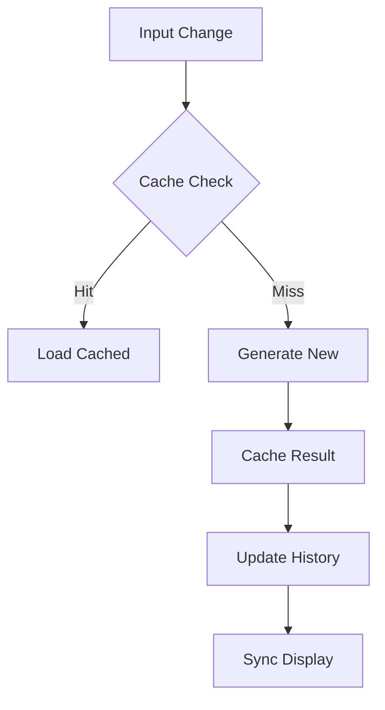
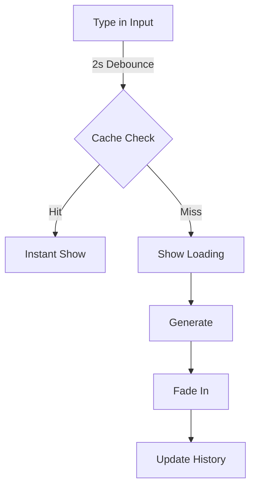
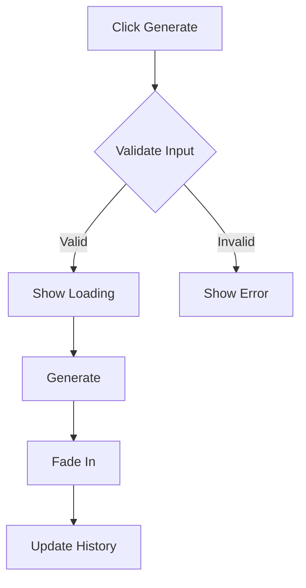
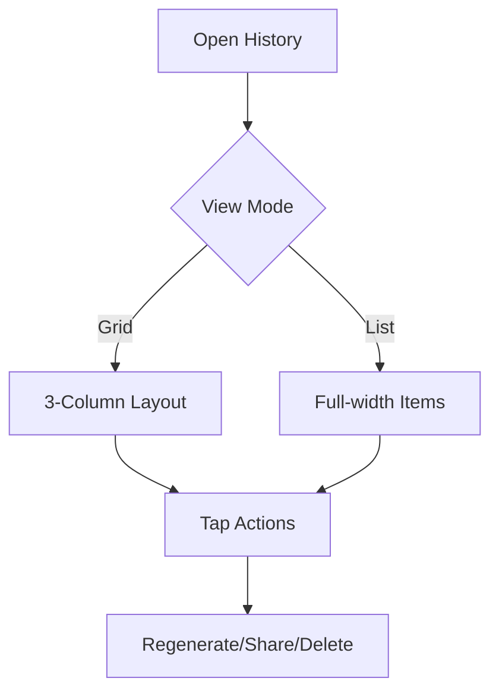

# Design Mastery: Real-time Image Generation Flow

## Current Pain Points
1. Inconsistent image generation for same prompts
2. Unnecessary API calls and regeneration
3. History not synced with current generation
4. Cache management missing
5. No deterministic generation strategy
6. Broken UI features after caching implementation
7. Lost interaction patterns
8. Missing visual feedback
9. Inconsistent state management
10. Poor error handling

## Enhanced User Journey

### 1. Image Generation Strategy
- **Deterministic Generation**
  - Hash-based seed for each prompt
  - Consistent output for identical prompts
  - Cache results in localStorage/IndexedDB
  - Invalidate cache after 24h

### 2. Primary Focus Zone
- **Hero Generation Area** (70% viewport height)
  - Real-time preview from cache if available
  - Clear loading states with progress
  - Ambient background that responds to prompt
  - Visual confirmation of cache hits

### 3. History Management
- **Optimized Storage**
  - Store prompt + image hash pairs
  - LRU cache for recent generations
  - Lazy loading for older entries
  - Batch updates to reduce rerenders

### 4. State Management Flow


### 5. Performance Optimizations
- **Caching Strategy**
  - In-memory LRU cache (recent)
  - IndexedDB for persistence
  - Service Worker for offline
  - Preload on hover/focus

- **Network Optimization**
  - Debounce API calls (2s)
  - Cancel pending for new
  - Queue management
  - Retry with backoff

### 6. Visual Feedback
- **Generation States**
  - Cache hit indicator (⚡)
  - Generation progress
  - Error recovery
  - Network status

### 7. Technical Implementation
```typescript
interface CacheEntry {
  prompt: string;
  imageUrl: string;
  hash: string;
  timestamp: number;
}

interface HistoryEntry extends CacheEntry {
  id: string;
  metadata: {
    generationTime: number;
    fromCache: boolean;
  }
}
```

### 8. Success Metrics
1. 100% consistency for identical prompts
2. 90% cache hit rate for common prompts
3. < 100ms for cached responses
4. Zero duplicate generations
5. Perfect history sync

### 9. Risk Mitigation
1. Cache invalidation strategy
2. Memory management
3. Race condition handling
4. Error recovery
5. Offline support

### 10. User Experience Goals
- **Confidence**
  - Clear indication of cache vs new
  - Progress visibility
  - History accuracy
  - Undo/redo support

- **Performance**
  - Instant cached responses
  - Smooth transitions
  - No duplicate work
  - Predictable output

### 11. Implementation Priority
1. Deterministic generation
2. Caching layer
3. History sync
4. UI feedback
5. Error handling

### 12. Monitoring
- Cache hit/miss ratio
- Generation time
- History sync status
- Error rates
- User satisfaction

## Core Features & Requirements

### 1. Real-time Toggle (⚡/🎯)
- **Functionality**
  - Manual Mode (🎯): Generate on submit only
  - Real-time Mode (⚡): Generate while typing
  - 2s indicator shows debounce timing
  - Disabled during generation
  - Smooth transition animations

### 2. Generation Button (🪄)
- **States**
  - Idle: Shows wand (🪄)
  - Generating: Shows sparkles (✨)
  - Disabled: When real-time is on
  - Error: Shows warning (⚠️)
  - Success: Brief checkmark (✓)

### 3. Input Field
- **Behavior**
  - Auto-focus on load
  - Maintains history on change
  - Debounced updates (2s)
  - Clear button when not empty
  - Character count/limit

### 4. History Panel (📖/📚)
- **Features**
  - Swipe up to open
  - Pull down to refresh
  - Tap prompt to regenerate
  - Share button per image
  - Delete capability
  - Grid/List view toggle

### 5. Image Display
- **States**
  - Loading: Blur + spinner
  - Error: Retry button
  - Success: Fade in
  - Placeholder: Gradient
  - Cache indicator

## Interaction Patterns

### 1. Real-time Flow


### 2. Manual Flow


### 3. History Interaction


## Visual States

### 1. Button States
- **Real-time Toggle**
  ```css
  Idle: bg-gray-100 hover:bg-gray-200
  Active: bg-blue-500/10 hover:bg-blue-500/20
  Disabled: opacity-50 cursor-not-allowed
  ```

- **Generate Button**
  ```css
  Idle: bg-blue-500/10 hover:bg-blue-500/20
  Loading: animate-spin
  Success: bg-green-500/10
  Error: bg-red-500/10
  ```

### 2. Input States
```css
Default: bg-gray-100/50
Focus: ring-2 ring-blue-500/30
Error: ring-2 ring-red-500/30
Disabled: opacity-50
```

### 3. History Panel
```css
Closed: h-0 translate-y-full
Opening: h-[70vh] translate-y-0
Dragging: touch-action-none
```

## Animation Timings
1. Toggle Switch: 300ms spring
2. Generate Button: 200ms ease
3. Image Fade: 400ms ease-out
4. History Panel: 500ms spring
5. Cache Indicator: 300ms bounce

## Error States
1. Network Error: Retry button
2. Invalid Input: Red outline
3. Generation Error: Warning icon
4. Cache Error: Fallback to new
5. History Error: Reload button

## Success Metrics
1. < 100ms input response
2. < 300ms animation frames
3. < 2s generation time
4. 0 UI freezes
5. 100% error recovery

## Implementation Priority
1. Fix broken interactions
2. Restore visual feedback
3. Add error handling
4. Improve animations
5. Enhance accessibility

## Technical Debt
1. Animation performance
2. State management
3. Error boundaries
4. Touch interactions
5. Accessibility

## Implementation Requirements

### Critical Components
1. Hero Generation Container
   - Prominent viewport positioning
   - Ambient background effects
   - Clear loading states

2. Smart Input Interface
   - Persistent positioning
   - Real-time validation
   - Contextual suggestions

3. Collapsible History
   - Gesture-based access
   - Efficient rendering
   - Clear chronology

### Technical Considerations
- Viewport management
- State persistence
- Memory optimization
- Animation performance
- Accessibility compliance

## Success Metrics
1. Reduced cognitive load
2. Increased focus on current task
3. Improved generation completion rate
4. Enhanced user satisfaction
5. Reduced error rates

## Risk Mitigation
1. Performance degradation
2. Memory management
3. Mobile responsiveness
4. Accessibility compliance
5. Browser compatibility 